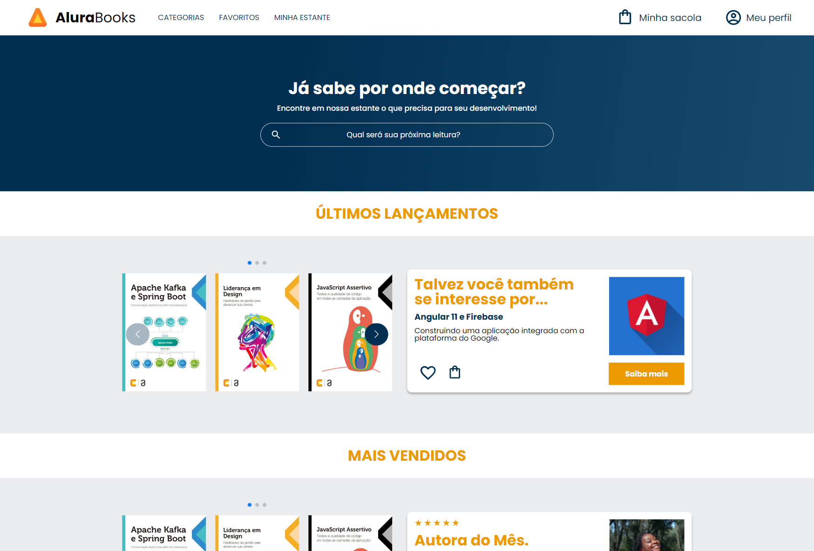

# AluraBooks

> AluraBooks

Projeto construído durante o curso HTML e CSS: Responsividade com Mobile-first, ministrado pela Alura.

[Clique aqui para acessar](https://paulomarquesdev.github.io/alurabooks-web-page/)

## Tecnologias

- HTML e CSS
- JavaScript

## 💻 Projeto

O AluraBooks é uma página de vendas de livros. A página foi desenvolvida com responsividade entre telas, aplicando a metodologia mobile-first.

## 🔖 Layout

Você pode visualizar o layout do projeto através [DESSE LINK](https://www.figma.com/file/sSMbIqKaGBd66Y8roxTk2p/AluraBooks/duplicate). É necessário ter conta no [Figma](https://figma.com) para acessá-lo.
